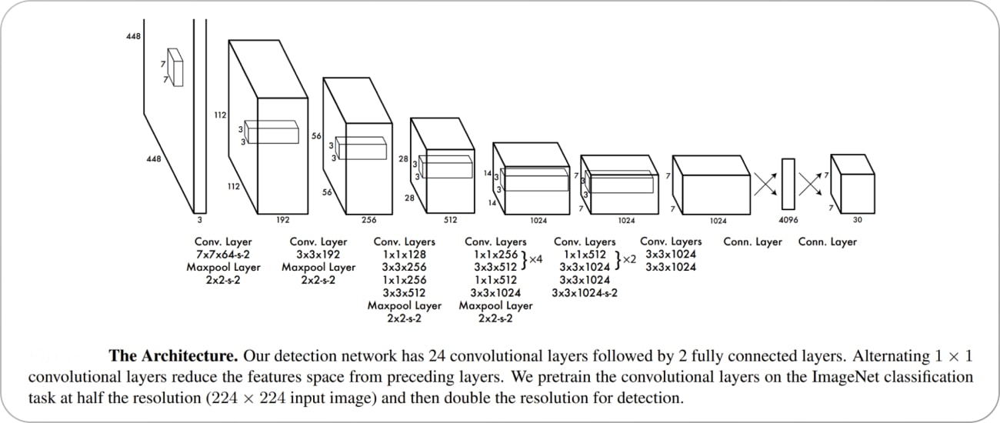

# Objective:
The objective of this project is to use a dataset of Personal Protective Equipment to train a model that can successfully monitor whether the safety equipment as required by the workplavce is followed or not.
# Model used:
I created my own YOLO model from scratch as explained in the paper " You Only Look Once: Unified, Real-Time Object Detection" by Joseph Redmon, Santosh Divvala, Ross Girshick, Ali Farhadis.
https://doi.org/10.48550/arXiv.1506.02640  
I also used transfer learning for initial convolution layers for feature extraction of classes using the weights of a resnet50 model trained on imagenet dataset.
#YOLO Model:
As compared to previous model i.e. Faster R-CNN, the YOLO model allows faster detection with performance par with the former.The YOLO algorithm takes an image as input and then uses a simple deep convolutional neural network to detect objects in the image. The architecture of the CNN model that forms the backbone of YOLO is shown below.

 

https://doi.org/10.48550/arXiv.1506.02640 

YOLO divides an input image into an S × S grid. If the center of an object falls into a grid cell, that grid cell is responsible for detecting that object. Each grid cell predicts B bounding boxes and confidence scores for those boxes. These confidence scores reflect how confident the model is that the box contains an object and how accurate it thinks the predicted box is.

YOLO predicts multiple bounding boxes per grid cell. At training time, we only want one bounding box predictor to be responsible for each object. YOLO assigns one predictor to be “responsible” for predicting an object based on which prediction has the highest current IOU with the ground truth. This leads to specialization between the bounding box predictors. Each predictor gets better at forecasting certain sizes, aspect ratios, or classes of objects, improving the overall recall score.

One key technique used in the YOLO models is non-maximum suppression (NMS). NMS is a post-processing step that is used to improve the accuracy and efficiency of object detection. In object detection, it is common for multiple bounding boxes to be generated for a single object in an image. These bounding boxes may overlap or be located at different positions, but they all represent the same object. NMS is used to identify and remove redundant or incorrect bounding boxes and to output a single bounding box for each object in the image. The steps followed by non-max suppression are as follows:
1. Select the bounding box for each object in the image with highest probability.
2. Check IOU > threshold for the selected bounding box. If other bounding boxes matches the condition, they are removed.
3. Iteration are performed until no more suppression is possible i.e. each object in the image has a single bounding box.

 

https://doi.org/10.48550/arXiv.1506.02640 

